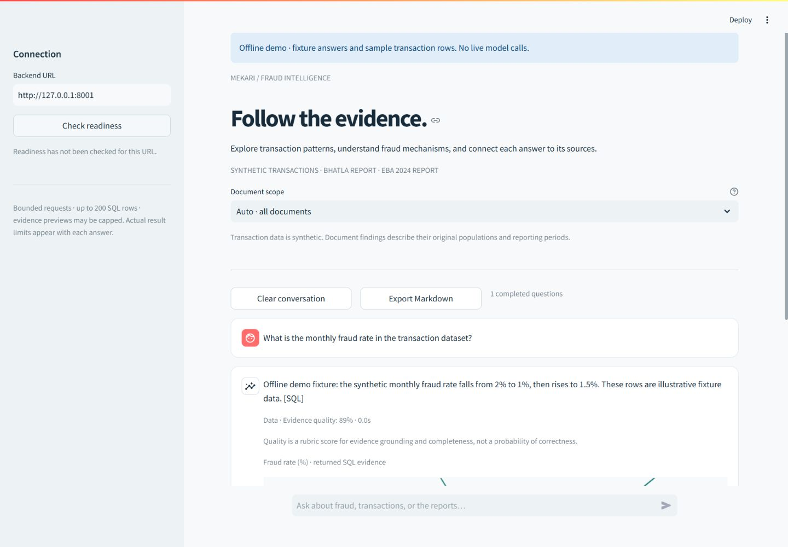
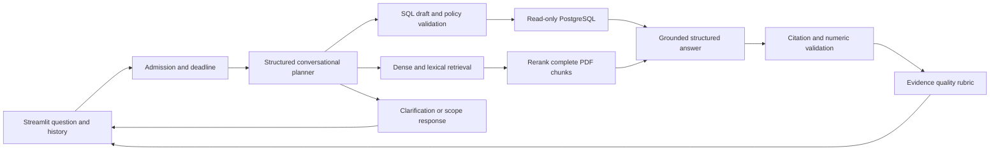

# Mekari Associate AI Engineer Challenge Test: Q&A Chatbot

Fraud Q&A over a synthetic credit-card transaction warehouse and two original reports: *Understanding Credit Card Frauds* (Bhatla et al.) and the EBA/ECB *2024 Report on Payment Fraud*. A Streamlit interface calls a FastAPI/LangGraph backend that selects SQL, document retrieval, or both, then answers with evidence and an explained quality score.

The challenge prioritizes accuracy. This implementation distinguishes source populations, reporting periods, fraud counts, rates, and value shares. It asks for clarification or declines to answer when evidence does not support a response.



This labelled offline fixture demonstrates the interface with sample rows, answers, and rubric values. It is not a live model evaluation. [Mobile demonstration](assets/demo/offline-mobile-answer.jpg).

## Structure and flow

```text
backend/app/
  main.py, schemas.py       HTTP contract and validation
  config.py, resources.py   Settings and lifespan-owned lazy dependencies
  runtime.py               Admission, inference slots, deadlines, safe errors
  agent/                   Planner → SQL/documents → answer → quality
  llm/openai_client.py      Structured provider calls and bounded retry
  rdb/postgresql_client.py  SQL policy and read-only bounded execution
  vdb/corpus.py             Corpus integrity and provenance
  vdb/qdrant_client.py      Hybrid retrieval, reranking, versioned cache
frontend/
  app.py                   Responsive chat and evidence views
  client.py                Bounded HTTP requests and safe errors
  presentation.py          History, retry, charts, export helpers
scripts/
  init_postgresql.py       Validate/restore snapshot; provision reader
  build_corpus.py          Cache models or rebuild original-PDF artifacts
  init_qdrant.py           Validate/upload version; atomically switch alias
  evaluate_retrieval.py    Offline benchmark with real cached models
  demo_backend.py          Explicit offline UI fixture
data/corpus/               Canonical manifest, page-aware chunks, LFS vectors
assets/evaluation/         Scenarios and actual retrieval report
tests/                     Offline and opt-in PostgreSQL checks
```



The planner resolves follow-ups from bounded conversation history and decomposes mixed questions. A selected document applies to document retrieval. SQL results and complete document excerpts are passed to both the answerer and judge. Final answers and generated SQL are not cached.

## Setup

Run commands from the repository root. The dependency lock and CI target **Windows and Python 3.11**. Public embedding/reranker weights require about 1.6 GB of downloads plus runtime memory. CPU inference uses four Torch threads; an NVIDIA GPU is optional.

```powershell
git lfs install
git lfs pull
py -3.11 -m venv .venv
.venv/Scripts/python.exe -m pip install -r requirements.txt
.venv/Scripts/python.exe -m pip check
Copy-Item .env.example .env
```

Copy the example only when `.env` does not already exist. Set separate `DB_ADMIN_USER`/`DB_ADMIN_PASSWORD` and `DB_USER`/`DB_PASSWORD`. The application user must be a dedicated warehouse reader, such as `fraud_reader`. Set `OPENAI_API_KEY` for live chat. Defaults use GPT-5 Mini for SQL/answers and GPT-5 Nano for planning/quality; configure the four model settings independently.

`.env` is ignored and preserved locally. A previous revision tracked it; removal from the current tree does not remove historical values. Rotate credentials exposed in that history.

Original GPT-5/Mini/Nano calls use low reasoning effort with an 8,192-token completion cap for SQL/answers and minimal effort with 2,048 tokens for planning/quality. These caps include reasoning tokens; other model families omit the family-specific effort parameter. This allocation is based on [OpenAI's reasoning guidance](https://developers.openai.com/api/docs/guides/reasoning), and live completion success remains unmeasured.

Start PostgreSQL and Qdrant yourself. Compose uses PostgreSQL 16 and Qdrant 1.17.0, persistent directories, and a PostgreSQL readiness check:

```powershell
docker compose up -d
docker compose ps
.venv/Scripts/python.exe scripts/init_postgresql.py
.venv/Scripts/python.exe scripts/build_corpus.py --cache-models-only
.venv/Scripts/python.exe scripts/init_qdrant.py
```

Initializers use configured, already-running services; they do not start or restart Docker. Database restoration requires a complete Git LFS `PGDMP` archive and an empty database by default. `--replace` explicitly permits cleaning snapshot objects in a nonempty target. Native `pg_restore` is preferred; otherwise the configured running PostgreSQL container is used. Restore is atomic. Administrator credentials are used only for restoration and provisioning. The reader receives SELECT on the nine warehouse objects, no write/create/temp privileges, a read-only default, and a statement timeout.

The canonical corpus is prebuilt; caching models does not regenerate it. Qdrant initialization validates local artifacts and sources before mutation, uploads `fraud_documents_<artifact_version>`, verifies payloads/vectors, and atomically activates the configured `fraud_documents` alias. Previous collections are retained. Do not reuse the historical `bhatla_credit_fraud` collection with this profile.

Start the application in separate terminals:

```powershell
.venv/Scripts/python.exe -m uvicorn backend.app.main:app --host 127.0.0.1 --port 8000
.venv/Scripts/python.exe -m streamlit run frontend/app.py
```

Open `http://localhost:8501`; API docs are at `http://localhost:8000/docs`. The frontend reads `FRAUD_API_BASE_URL`, defaulting to `http://localhost:8000`. Use one backend worker for the documented resource limits; limits are per process.

## Evidence and accuracy

**Warehouse.** Preparation combines 1,296,675 training and 555,719 test records into 1,852,394 synthetic transactions. The star schema has `dim_customer`, `dim_merchant`, `dim_category`, `dim_date`, and `fact_transactions`; materialized views are `agg_daily_fraud`, `agg_monthly_fraud`, `agg_merchant_fraud`, and `agg_category_fraud`.

Fraud rates are fractions: fraud count / total count. Value shares use fraud amount / total amount. Aggregate rates require summed numerators and denominators, not averages of rates. Trends are chronological. Amounts display in dataset units because the warehouse does not establish a currency. Views are a snapshot; deliberately refresh them after data changes.

SQL is parsed as PostgreSQL before execution. Only one read-only SELECT/set-operation statement, the nine public warehouse objects, and explicitly allowed expressions/functions/casts are accepted. CTE scopes are validated. Writes, locks, system catalogs, recursion, table functions, and unsafe functions are rejected. Execution uses `search_path=pg_catalog` with explicit public qualification, a read-only transaction, rollback on every exit, a maximum 10-second statement timeout, and bounded rows/cells/columns/bytes. Only known syntax/schema failures allow one repair. Returned SQL is the actual executed statement.

**Documents.** The canonical corpus uses the original 17-page Bhatla and 35-page EBA/ECB PDFs. Chunks have stable IDs, source SHA-256, titles, physical one-based PDF pages, sections, token counts, and vector rows. BGE passages are plain text; queries use `Represent this sentence for searching relevant passages: `. The manifest pins model revisions and weight hashes. Historical DOCX summaries and JSON/NPY exports stay separate.

Canonical JSON uses LF line endings explicitly, including on Windows, so Git checkouts preserve manifest file hashes.

Retrieval unions dense and BM25 lexical candidates, reranks with BGE, applies document filters, and keeps up to eight complete chunks in a 6,000-token budget. Its bounded cache includes corpus version, embedding profile, active alias, filter, and resolved question. Runtime never downloads weights. [Corpus details and rebuild commands](data/corpus/README.md).

EBA chart text warns when numeric labels cannot reliably be paired with series/periods. Bhatla page 15 preserves Figure 2's 0.08% fraud-loss label and the conflicting 0.06% prose value; answers must expose that conflict. EBA H1 2023 cross-border card fraud is 71% by value and 68% by volume. Those figures describe the report's population, not the synthetic dataset.

**Answers.** Every substantive paragraph must cite supplied document IDs or `[SQL]`. Numeric checks use the sources cited by that paragraph. Mixed answers require both evidence branches. Unsupported structured responses become fixed abstentions. These checks reduce errors but do not prove semantic correctness.

The quality rubric weights evidence support 40%, relevance 20%, completeness 20%, and consistency 20%, using exactly the answer evidence. Low support/consistency causes abstention. `quality_score` is not a calibrated probability. If judging fails, `quality_available=false` and the UI shows N/A; numeric zero is a compatibility sentinel.

## Reliability and API

Defaults: four admitted chats, one inference slot, 120-second request deadline, 30-second external-call cap, 10-second SQL timeout, four database connections, 200 returned rows, and 20 rows in answer prompts. Saturation returns a retryable 503 promptly. Inference capacity remains held until native work finishes. Provider calls permit one transient retry with SDK retries disabled. Imports and `/live` do not connect or load models.

| Endpoint | Behavior |
| --- | --- |
| `GET /live` | Process liveness, no dependency I/O |
| `GET /health` | Compatibility readiness report, 200 when degraded |
| `GET /ready` | Dependency readiness, 503 when degraded; cached five seconds |
| `POST /chat` | Question, nullable history, nullable document selection |

Readiness checks warehouse objects/permissions, active Qdrant corpus, local model availability, and configured provider key. It does not spend a provider call or prove the key valid. Chat can use a working branch when unrelated dependencies are unavailable.

```json
{
  "question": "What share of card fraud value in H1 2023 was cross-border?",
  "history": [],
  "document_id": "eba"
}
```

Responses retain `answer`, `answer_type`, `quality_score`, `sql`, `sources`; additions include `status`, quality details, `request_id`, `elapsed_ms`, `timings`, and `truncated`. Types are data/document/mixed/other; statuses are answered/clarification/insufficient_evidence. Questions accept 1–4,000 characters, history up to 12 user/assistant messages of 1–8,000 characters, and document selection is null/`bhatla`/`eba`.

Errors return a safe code/message/retryable/request-ID object: 422 validation, 503 saturation/dependency, 504 deadline, or 500 unexpected failure. Logs contain identifiers/types/status/timings, not questions, evidence, keys, or driver errors. Local CORS has explicit origins and no credential sharing.

The responsive frontend disables submission/scope changes while pending, excludes failed turns from history, retries with original request context, displays evidence and quality details, and exports completed conversations as Markdown. Charts use returned SQL fields only.

## Verification and demonstration

Default checks require no provider, database server, model download, or paid call:

```powershell
.venv/Scripts/python.exe -m ruff check backend frontend scripts tests
.venv/Scripts/python.exe -m ruff format --check backend frontend scripts tests
.venv/Scripts/python.exe -m pytest -q
.venv/Scripts/python.exe -m pip check
```

Opt-in PostgreSQL tests use only a disposable local instance on `127.0.0.1:15432` with a `postgres` administrator. They create/remove unique databases and roles and cannot target the configured application database. Enable only for that disposable instance:

```powershell
$env:FRAUD_TEST_LOCAL_POSTGRES = '1'
.venv/Scripts/python.exe -m pytest -q
Remove-Item Env:FRAUD_TEST_LOCAL_POSTGRES
```

Checks cover hostile SQL, transactions/privileges, deadlines/saturation/cleanup, structured SDK requests with a mock transport, citation/number grounding, cache/filter/version behavior, HTTP errors, history/retry/export, and Streamlit AppTest. Local database tests ran on PostgreSQL 18; Compose targets 16. Qdrant transport is unit-tested; actual retrieval benchmarking uses in-memory Qdrant and real cached models.

Final local verification: **183 passing tests**, including **25 real PostgreSQL checks**, plus clean lint, formatting, dependency, artifact-checkout and independent review checks. The default suite skips those 25 opt-in database cases.

```powershell
.venv/Scripts/python.exe scripts/evaluate_retrieval.py
```

[Scenarios](assets/evaluation/questions.json) include the challenge examples and follow-up, mixed, ambiguous, unrelated, value/volume, coverage, and source-conflict cases. The [measured report](assets/evaluation/retrieval_report.json) contains seven documentary probes with hit@8, reciprocal rank, gold-term presence, citations, and runtime. It measures retrieval only; planner, SQL generation, answer accuracy, and quality calibration need a separately budgeted live evaluation.

The recorded run retrieved a gold page for all seven probes (hit@8 **1.0**), mean reciprocal rank **0.655**, and every listed gold term. On the local four-thread CPU, the cold first query took about 64 seconds and subsequent queries 19–26 seconds. This small benchmark establishes coverage of these probes, not general retrieval accuracy or live answer latency.

For an entirely offline interface demo, use separate terminals:

```powershell
.venv/Scripts/python.exe -m uvicorn scripts.demo_backend:app --host 127.0.0.1 --port 8001
```

```powershell
$env:FRAUD_API_BASE_URL = 'http://127.0.0.1:8001'
$env:FRAUD_DEMO_MODE = '1'
.venv/Scripts/python.exe -m streamlit run frontend/app.py --server.port 8502
```

The banner and fixture answers identify demo mode. Desktop (1440 px) and mobile (390 px) browser checks verified submission, citations, charts, export, and clearing without console errors. CI runs default offline checks on Windows/Python 3.11 and verifies paired contributor guides.

## Contribution notes

Follow [AGENTS.md](AGENTS.md) or matching [CLAUDE.md](CLAUDE.md). [PLANS.md](PLANS.md) records the implementation sequence. `requirements.in` holds direct dependencies; `requirements.txt` is the Windows/Python 3.11 lock. Backend/frontend manifests include it. Regenerate the lock deliberately when dependencies change.

Historical preparation notebooks/exports retain separate dependency manifests. They run destructive database/file operations at module scope; do not import them or use them for runtime setup. Preserve PDFs, raw data, snapshots, and legacy artifacts. Streaming, distributed admission, migrations, and calibrated live answer benchmarks remain future work.
